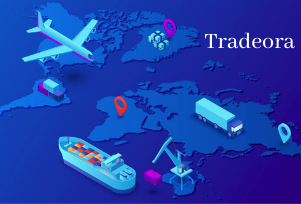
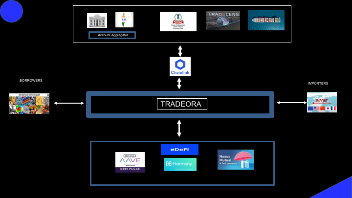
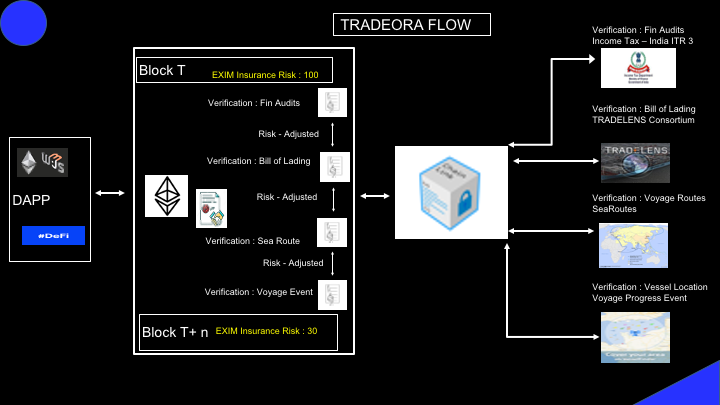
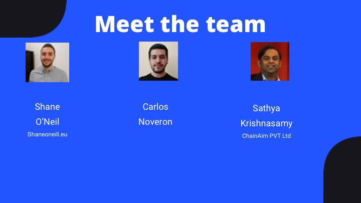

  

### Trade Finance Oracles for Verifiable Trade Loans and Insurance

Tradeora focuses on 
    Global inclusivity for Small to Medium Enterprises in EXportIMport Trade including developing countries 
    Bridge the Unmet trade financing needs to decentralized trade financing 
    Derisking oracles for smart contract executions in the Ethereum Ecosystem for trade financing loans and insurance
    Overcoming derisking validations due to distance and jurisdictions
    Mitigating Fraud Risk

## Deliverables

* ### [Presentation:](https://drive.google.com/file/d/1YIOu-1YIAvzzAfT118pZpPWD9uhG1Qbl/view?usp=sharing) Please follow the link

* ### [Demo video:] Please follow the link

## Solution Highlights  

The Presentation Demonstration, the Video demonstration and GitHub illustrations vividly

explains the problem and the solution aspects

### Tradeora 

###  Focuses on MicroSmallandMediumEnterprises 

      Proprietorship business –  10 K to 1 M USD Loans 
      
      At the Low end of Goods and Service Tax( India ) or NOT yet in GST
      
      Exports - Nuetracueticals, Textiles, Food. Imports – Electronics, Chemicals, Raw Material
      
      Needs access to formal finance
      
###  Specific painpoints

      Working capital gaps and “Export/ Import” Credits. They produce BLs for loans. 
      
      Input Tax Credit Receivables, and Export Duty subsidies eventually arrive but puts lot of short-term cash flow deficit.
      
      Most of these businesses are operations-oriented and current options for the are very high in interest rates.

Please refer to the details at 

https://github.com/chainaim3003/tradeora/blob/master/README.md

## Illustrations

## Tradeora :  Flow

ChainLink Oracles for trade financing derisking

# Team

  

* ### Sathya krishnasamy
   

 * ### Shane O'Neill
      shaneoneill.eu

 * ### Carlos Noveron
      

# Contract Addresses
* ### APIS:
Bill Of Lading API Address = 0x8aa6770525aC4f3D5285773C5E8C0c38795d4314

Income Tax Returns Address = 0x1da394a1be2a66F5BBe8F894755Af7d7240A29D0

Vessels API = 0x1dc95B3698d75050815995FD256A206c7C52ae75
* ### Underwriting:
Underwriting Contract= 0x38aa7733681A9b4B4743f100E6B837397129eB59
  
